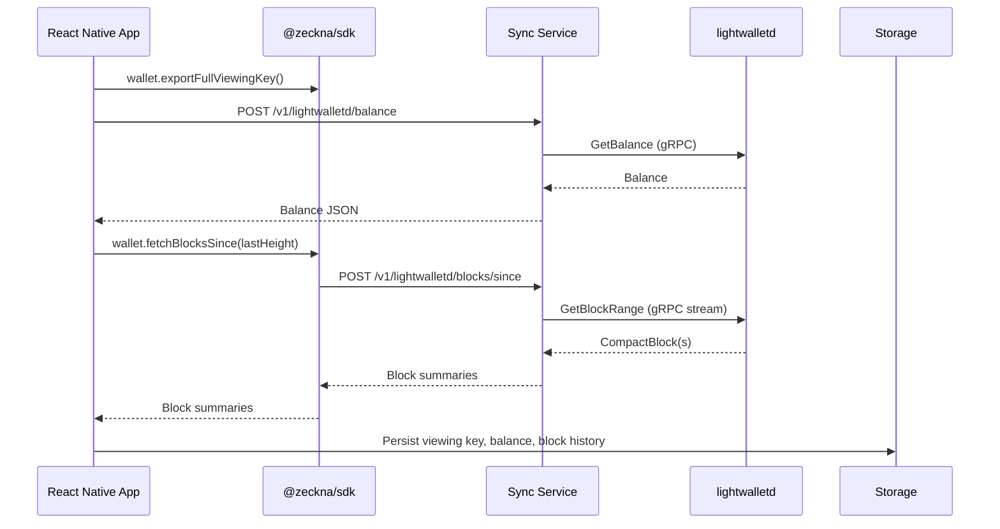

Zeckna keeps wallet state in sync with the Zcash network by combining the Rust core (compiled to WASM), the TypeScript SDK, and a lightweight sync service that connects to `lightwalletd`.

## Overview

1. **Rust Core (`@zeckna/core`)**  
   - Exposes wallet primitives (seed generation, viewing key export, transaction building) via WASM.
   - Provides `export_full_viewing_key` to derive a viewing key from the mnemonic for a given account.

2. **TypeScript SDK (`@zeckna/sdk`)**  
   - Wraps the WASM module and provides a `Wallet` class.  
   - Handles viewing key retrieval and integrates a `SyncServiceClient` that talks to the sync microservice.  
   - New helpers:
     - `wallet.fetchShieldedBalance(address, viewingKey)`
     - `wallet.fetchBlocksSince(height, limit?)`
     - `SyncServiceClient.getBlocksSince(sinceHeight, limit?)`

3. **Sync Service (`@zeckna/sync-service`)**  
   - Node/Express microservice that proxies to `lightwalletd` over gRPC.  
   - Exposes REST endpoints:
     - `GET /health`
     - `GET /v1/lightwalletd/info`
     - `GET /v1/lightwalletd/latest-block`
     - `POST /v1/lightwalletd/balance`
     - `POST /v1/lightwalletd/blocks`
     - `POST /v1/lightwalletd/blocks/since`
   - Adds retry/backoff and normalizes block summaries (height/hash/time/tx count).

4. **Mobile Wallet (`@zeckna/mobile`)**  
   - Initializes the WASM wallet, stores the viewing key securely, and calls the SDK helpers.  
   - Periodically syncs in the background (default every 60s) while the app is active.  
   - Persists latest block summaries and displays status + recent activity in the UI.

## Data Flow



## API Responses

- **Shielded Balance**

```json
{
  "address": "zs1...",
  "balance": {
    "valueZat": 12345,
    "verifiedValueZat": 12000,
    "spendableValueZat": 12000
  },
  "latestHeight": 246000
}
```

- **Blocks Since**

```json
{
  "startHeight": 245981,
  "endHeight": 246000,
  "latestHeight": 246005,
  "limit": 100,
  "blocks": [
    {
      "height": 245999,
      "hash": "base64hash==",
      "time": 1700000000,
      "transactions": 3
    }
  ]
}
```

## Running Locally

```bash
# Start sync service (default port 4000)
pnpm --filter @zeckna/sync-service dev

# Run SDK tests
pnpm --filter @zeckna/sdk test

# Run mobile tests
pnpm --filter @zeckna/mobile test
```

Ensure the `LIGHTWALLETD_ENDPOINT` env var is configured if you are pointing at a non-default server.

## Production Notes

- Sync service is expected to run behind Caddy with TLS.  
- Mobile app schedules periodic syncs; adjust the interval in `useWallet.ts` if needed.  
- For deterministic QA, clear stored viewing keys/blocks via `StorageService.clearAll()`.


